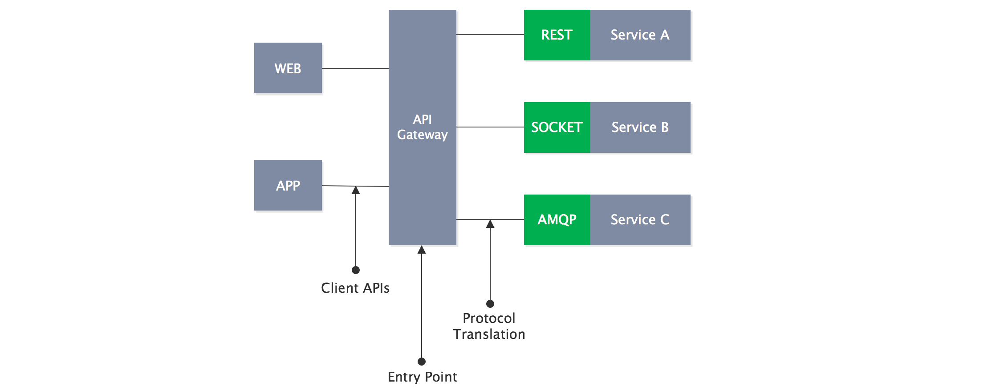
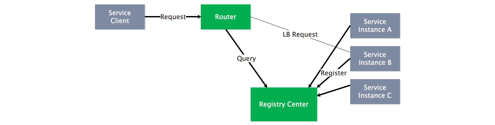
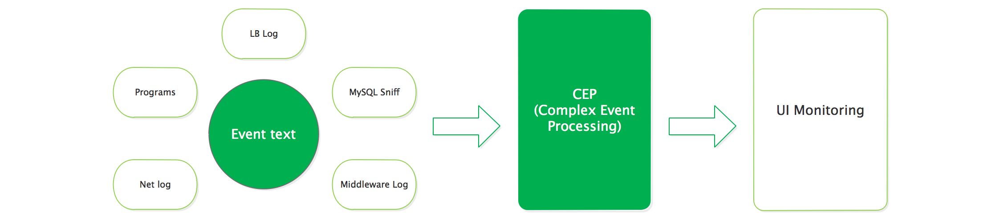

# 常见问题

### 服务如何访问？

### 服务如何发现？

### 服务如何通信？

|  | 一对一 | 一对多 |
| --- | --- | --- |
| 同步 | 请求／响应 | ——— |
| 异步 | 通知 | 发布／订阅 |
|  | 请求／异步响应 | 发布／异步响应 |

同步调用：REST（JAX-RS、Spring Boot）、RPC（Thrift、Dubbo）

异步调用：Akka Actor、Kafka、Notify、MQ

### 数据如何管理？

常见方式：共享数据库、消息队列事件驱动：Event Sourcing、CQRS

### 服务如何容错？

防⽌应⽤用程序试图调⽤远程服务或访问共享资源失败

异常处理理、⽇日志记录、测试失败操作、资源分化、并发等等

### 服务如何监控？

