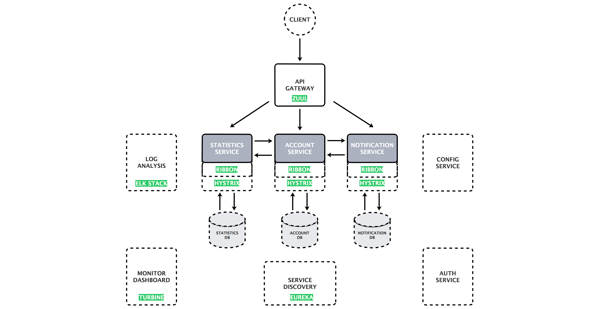

# [云框架]基于Spring Cloud的微服务架构 v0.1

[微服务](https://martinfowler.com/articles/microservices.html)近年来受到了众多开发者的追捧。相比传统架构模式，微服务架构具有语言无关性、独立进程通讯、高度解耦、任务边界固定、按需扩展等特点，非常适合互联网公司快速交付、响应变化、不断试错的需求，也因此受到了像Twitter、Netflix、Amazon、eBay这样的科技巨头的青睐（[案例](https://mp.weixin.qq.com/s?__biz=MzIwMDA2OTI0Mw==&mid=2653449136&idx=2&sn=0e6bc2215646064c9a35398a8fb00299&chksm=8d5e12a4ba299bb2bf75f5b8aebb645c186932b6507dbd2ca9372dbd5b0f4d0a5a43e9fce72d#rd)）。

目前主流微服务框架包括Spring Cloud、Dubbo、API Gateway等，其中[Spring Cloud](http://projects.spring.io/spring-cloud/)是Pivotal提供的云应用开发工具，利用Spring Boot的开发便利性，Spring Cloud为JVM云应用开发中的配置管理、服务发现、断路器、智能路由、微代理、控制总线、全局锁、决策竞选、分布式会话和集群状态管理等操作提供了一种简单的实现方式。

相比Dubbo等RPC（远程过程调用协议）框架，Spring Cloud是一个比较新的微服务架构基础框架选择，2016年才推出的1.0 release版本，不过Spring Cloud的方案完整度非常高，各个子项目几乎覆盖了微服务架构的方方面面。从目前的关注度和活跃度来看，Spring Cloud很可能会成为微服务架构的标准。

本篇[云框架](ABOUT.md)目的不在于重复造轮，而是总结过去数十个微服务架构项目的成功经验，绕过前人踩过的坑，为开发者提供微服务落地的最佳实践。不必从零开始开发，开发者仅需在[云框架]基础上替换部分业务代码，就可以将[基于Spring Cloud的微服务架构](README.md)应用于生产环境并立即产生价值。

# 内容概览

* [框架组件](#框架组件)
* [在线演示](#在线演示)
* [快速部署](#快速部署)
* [框架说明](#框架说明) 
   * [整体架构](#整体架构)
   * [基础模块](#基础模块)
   * [业务模块](#业务模块)
   * [其他组件](#其他组件)
   * [高级操作](#高级操作)
* [常见问题](#常见问题)
* [更新计划](#更新计划)
* [参与贡献](#参与贡献)
* [加入社群](#加入社群)

# 框架组件（不含业务代码）

[云框架]基于Spring Cloud的微服务架构核心组件有：

* [Spring Cloud Config - server](https://github.com/cloudframeworks-springcloud/Spring-Cloud-Config-server)
* [Spring Cloud Config - client](https://github.com/cloudframeworks-springcloud/Spring-Cloud-Config-client)
* [Spring Cloud Config - 配置文件](https://github.com/cloudframeworks-springcloud/Spring-Cloud-Config-client)
* [Netflix Eureka - server](https://github.com/cloudframeworks-springcloud/Netflix-Eureka-server)
* [Netflix Eureka - service](https://github.com/cloudframeworks-springcloud/Netflix-Eureka-service)
* [Netflix Zuul](https://github.com/cloudframeworks-springcloud/Netflix-Zuul)
* [Netflix Ribbon](https://github.com/cloudframeworks-springcloud/Netflix-Ribbon)
* [Netflix Hystrix](https://github.com/cloudframeworks-springcloud/Netflix-Hystrix)
* [Netflix Feign](https://github.com/cloudframeworks-springcloud/Netflix-Feign)
* [Spring Cloud Sleuth](https://github.com/cloudframeworks-springcloud/Spring-Cloud-Sleuth)

**以下内容以[PiggyMetrics](https://github.com/sqshq/PiggyMetrics)（一款个人财务管理应用）为例说明**

# 在线演示 x

# 快速部署

* 开发环境（准备工作、操作步骤）
* 生产环境（准备工作、操作步骤）

# 框架说明

Piggymetrics（[查看应用](http://my-piggymetrics.rhcloud.com/)）由账户服务（[ACCOUNT SERVICE](https://github.com/sqshq/PiggyMetrics#account-service)）、统计服务（[STATISTICS SERVICE](https://github.com/sqshq/PiggyMetrics#statistics-service)）、通知服务（[NOTIFICATION SERVICE](https://github.com/sqshq/PiggyMetrics#notification-service)）等三个核心微服务组成，其中：

* 每个微服务都是围绕业务能力组织的可独立部署的应用程序
* 每个微服务都拥有独立的数据库（MangoDB，支持多种编程语言持久性架构）
* 微服务与微服务之间通信使用同步的REST API

PiggyMetrics基础服务设施中用到了Spring Cloud Config、Netflix Eureka、Netflix Hystrix、Netflix Zuul、Netflix Ribbon等组件，而这也正是Spring Cloud分布式开发中最核心的5个组件。

**整体架构如下图所示**

## 基础模块

### Spring Cloud Config （配置管理）

##### 完整代码

##### 业务代码标注

### Netflix Eureka （服务发现）

##### 完整代码

##### 业务代码标注

### Netflix Zuul （API网关）

##### 完整代码

##### 业务代码标注

## 业务模块

### 账户服务模块（ACCOUNT SERVICE）

在Piggymetrics项目中，账户服务模块包含一般用户输入逻辑和验证：收入/费用项目，储蓄和帐户设置。

方法	| 路径	| 描述	| 用户验证	| UI可用
------------- | ------------------------- | ------------- |:-------------:|:----------------:|
GET	| /accounts/{account}	| 获取特定账户数据	|  | 	
GET	| /accounts/current	| 获取当前账户数据	| × | ×
GET	| /accounts/demo	| 获取demo账户数据 (预填充收入/支出项目等)	|   | 	×
PUT	| /accounts/current	| 保存当前账户数据	| × | ×
POST	| /accounts/	| 注册新账户	|   | ×

#### Netflix Ribbon （负载均衡）

##### 完整代码

##### 业务代码标注

#### Netflix Hystrix （熔断器）

##### 完整代码

##### 业务代码标注

#### MangoDB （数据库）

##### 完整代码

##### 业务代码标注

#### 组件关系

### 统计服务模块（STATISTICS SERVICE）

在Piggymetris项目中，统计服务模块对主要统计参数执行计算，并为每个帐户的时间序列。数据点包含基准货币和时间段的值。此数据用于跟踪帐户生命周期中的现金流动动态（尚未在UI中实现的花式图表）。

方法	| 路径	| 描述 | 用户验证	| UI可用
------------- | ------------------------- | ------------- |:-------------:|:----------------:|
GET	| /statistics/{account}	| 获取特定账户统计	          |  | 	
GET	| /statistics/current	| 获取当前账户统计	| × | × 
GET	| /statistics/demo	| 获取demo账户统计	|   | × 
PUT	| /statistics/{account}	| 创建或更新时间系列数据点指定的帐户	|   | 

#### Netflix Ribbon （负载均衡）

##### 完整代码

##### 业务代码标注

#### Netflix Hystrix （熔断器）

##### 完整代码

##### 业务代码标注

#### MangoDB （数据库）

##### 完整代码

##### 业务代码标注

#### 组件关系

### 通知服务模块（NOTIFICATION SERVICE）

在Piggymetrics项目中，存储用户联系信息和通知设置（如提醒和备份频率）。计划工作人员从其他服务收集所需的信息，并向订阅的客户发送电子邮件。

方法	| 路径	| 描述	| 用户验证	| UI可用
------------- | ------------------------- | ------------- |:-------------:|:----------------:|
GET	| /notifications/settings/current	| 获取当前账户通知设置	| × | ×	
PUT	| /notifications/settings/current	| 保存当前账户通知设置	| × | ×

#### Netflix Ribbon （负载均衡）

##### 完整代码

##### 业务代码标注

#### Netflix Hystrix （熔断器）

##### 完整代码

##### 业务代码标注

#### MangoDB （数据库）

##### 完整代码

##### 业务代码标注

#### 组件关系

## 其他组件 x

### Spring Cloud Sleuth

##### 完整代码

##### 业务代码标注

### Netflix Turbine

##### 完整代码

##### 业务代码标注

## 高级操作 x

### CI/CD

### 日志

### 监控

### 安全

### ...

# 常见问题

任何相关问题均可通过[GitHub ISSUE](https://github.com/cloudframeworks-springcloud/user-guide/issues)提交或讨论，问题总结请查看[[QA](QA.md)]

# 更新计划

* 增加Turbine、Consul组件
* 增加CI/CD、日志、监控、安全实现方案
* 增加版本依赖关系说明
* 增加好雨云帮部署
* 增加云框架在线演示

# 参与贡献

[如何成为云框架贡献者](CONTRIBUTING.md)

# 加入社群

+ [订阅邮件](http://goodrain.us15.list-manage.com/subscribe?u=1874f1de4ed82a52890cefb4c&id=b88f73ca56)
+ QQ群1: 531980120
+ 微信二维码（发布时补充）
+ [联系我们](mailto:info@goodrain.com)

-------

[云框架](ABOUT.md)系列主题，遵循[APACHE LICENSE 2.0](LICENSE.md)协议发布。
