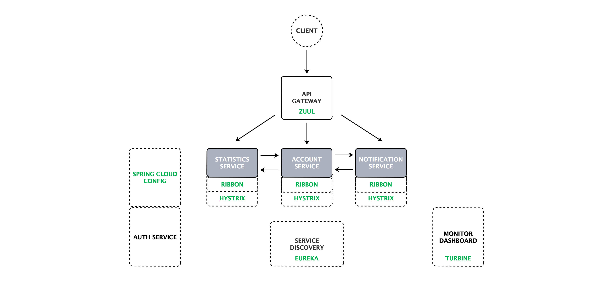

# [云框架]基于Spring Cloud的微服务架构 v0.1


[](CHANGELOG.md)

[](CONTRIBUTORS.md)

[微服务](https://martinfowler.com/articles/microservices.html)近年来受到了众多开发者的追捧。相比传统架构模式，微服务架构具有语言无关性、独立进程通讯、高度解耦、任务边界固定、按需扩展等特点，非常适合互联网公司快速交付、响应变化、不断试错的需求，也因此受到了像Twitter、Netflix、Amazon、eBay这样的科技巨头的青睐（[案例](https://mp.weixin.qq.com/s?__biz=MzIwMDA2OTI0Mw==&mid=2653449136&idx=2&sn=0e6bc2215646064c9a35398a8fb00299&chksm=8d5e12a4ba299bb2bf75f5b8aebb645c186932b6507dbd2ca9372dbd5b0f4d0a5a43e9fce72d#rd)）。

目前主流微服务框架包括Spring Cloud、Dubbo、API Gateway等，其中[Spring Cloud](http://projects.spring.io/spring-cloud/)是Pivotal提供的云应用开发工具，利用Spring Boot的开发便利性，Spring Cloud为JVM云应用开发中的配置管理、服务发现、断路器、智能路由、微代理、控制总线、全局锁、决策竞选、分布式会话和集群状态管理等操作提供了一种简单的实现方式。

相比Dubbo等RPC（远程过程调用协议）框架，Spring Cloud是一个比较新的微服务架构基础框架选择，2016年才推出的1.0 release版本，不过Spring Cloud的方案完整度非常高，各个子项目几乎覆盖了微服务架构的方方面面。从目前的关注度和活跃度来看，Spring Cloud很可能会成为微服务架构的标准。

本篇[云框架](ABOUT.md)目的不在于重复造轮，而是总结过去数十个微服务架构项目的成功经验，绕过前人踩过的坑，结合典型案例，为开发者提供微服务落地的最佳实践。

* 对于初学者来说，可以通过结合实例的代码、文档快速学习Spring Cloud及微服务，并在社群中交流讨论；
* 对于已有一定了解，想要使用的开发者来说，不必从零开始开发，仅需在云框架基础上替换部分业务代码，就可以将[基于Spring Cloud的微服务架构](README.md)应用于生产环境并立即产生价值。

**以下内容以[PiggyMetrics](https://github.com/cloudframeworks-springcloud/PiggyMetrics)（一款个人财务管理应用）为例说明**

# 内容概览

* [快速部署](#快速部署)
   * [镜像部署](#镜像部署)
* [框架说明](#框架说明) 
   * [业务](#业务)
      * [业务背景](#业务背景)
      * [业务架构](#业务架构)
      * [业务模块](#业务模块)
   * [组件](#组件)
      * [组件架构](#组件架构)
      * [Spring Cloud Config](#Spring-Cloud-Config)
      * [Netflix Eureka](#Netflix-Eureka)
      * [Netflix Zuul](#Netflix-Zuul)
      * [Netflix Ribbon](#Netflix-Ribbon)
      * [Netflix Hystrix](#Netflix-Hystrix)
      * [Netflix Feign](#Netflix-Feign)
* [如何变成自己的项目](#如何变成自己的项目)
* [生产环境](#生产环境)
* [常见问题](#常见问题)
* [更新计划](#更新计划)
* [参与贡献](#参与贡献)
* [加入社群](#加入社群)

# <a name="快速部署"></a>快速部署

## <a name="镜像部署"></a>镜像部署

### Docker环境准备

* **centos**

    ```
    1.清除docker 旧版本
    
      rpm -qa |grep docker
      yum  -y  remove docker* 
        
    2.安装新的docker
    
      yum install -y docker-engine
        
    3.systemctl  start docker
    
    4.docker info 查看docker状态
    ```

* **ubuntu**

    ```
    1.更新apt包
    
      sudo apt-get update
        
    2.安装 Docker
    
      sudo apt-get install docker-engine
        
    3.sudo service docker start
    
    4.docker info 查看docker状态
    ```

* **mac**

    参考[https://docs.docker.com/docker-for-mac/](https://docs.docker.com/docker-for-mac/)


### 操作步骤

1. 克隆完整代码

   [https://github.com/cloudframeworks-springcloud/PiggyMetrics](https://github.com/cloudframeworks-springcloud/PiggyMetrics)

2. 设置环境变量

   ```
   export CONFIG_SERVICE_PASSWORD=root
   export NOTIFICATION_SERVICE_PASSWORD=root
   export STATISTICS_SERVICE_PASSWORD=root
   export ACCOUNT_SERVICE_PASSWORD=root
   export MONGODB_PASSWORD=root
   ```
    
    mongo_password为必填项，其它变量可以不用设置

3. 基于docker-compose运行:

   ```
   docker-compose -f docker-compose.yml up -d
   ```

4. 通过脚本运行：

   ```
   docker run -d -p15672:15672 --name=rabbitmq rabbitmq:3-management

   docker run -d -e CONFIG_SERVICE_PASSWORD=${CONFIG_SERVICE_PASSWORD} -p 8888:8888 --name=config goodraincloudframeworks/piggymetrics-config
    
   docker run -d -e CONFIG_SERVICE_PASSWORD=${CONFIG_SERVICE_PASSWORD} --link config:config --name=registry -p 8761:8761 goodraincloudframeworks/piggymetrics-registry
    
   docker run -d -e MONGODB_PASSWORD=${MONGODB_PASSWORD} --name auth-mongodb goodraincloudframeworks/piggymetrics-mongodb
    
   docker run -d  -e CONFIG_SERVICE_PASSWORD=${CONFIG_SERVICE_PASSWORD} -e NOTIFICATION_SERVICE_PASSWORD=${NOTIFICATION_SERVICE_PASSWORD} -e STATISTICS_SERVICE_PASSWORD=${STATISTICS_SERVICE_PASSWORD} -e ACCOUNT_SERVICE_PASSWORD=${ACCOUNT_SERVICE_PASSWORD} -e MONGODB_PASSWORD=${MONGODB_PASSWORD} --link config:config --link auth-mongodb:auth-mongodb --link registry:registry --name=auth-service goodraincloudframeworks/piggymetrics-auth-service
    
   docker run -d -e MONGODB_PASSWORD=${MONGODB_PASSWORD} --name account-mongodb goodraincloudframeworks/piggymetrics-mongodb

   docker run -d -e CONFIG_SERVICE_PASSWORD=${CONFIG_SERVICE_PASSWORD} -e ACCOUNT_SERVICE_PASSWORD=${ACCOUNT_SERVICE_PASSWORD} -e MONGODB_PASSWORD=${MONGODB_PASSWORD} --link config:config --link account-mongodb:account-mongodb --link registry:registry --link auth-service:auth-service --link rabbitmq:rabbitmq --name=account-service goodraincloudframeworks/piggymetrics-account-service
    
   docker run -d -e MONGODB_PASSWORD=${MONGODB_PASSWORD} --name statistics-mongodb goodraincloudframeworks/piggymetrics-mongodb

   docker run -d -e CONFIG_SERVICE_PASSWORD=${CONFIG_SERVICE_PASSWORD} -e STATISTICS_SERVICE_PASSWORD=${STATISTICS_SERVICE_PASSWORD} -e MONGODB_PASSWORD=${MONGODB_PASSWORD} --link config:config --link statistics-mongodb:statistics-mongodb --link registry:registry --link auth-service:auth-service --link rabbitmq:rabbitmq --name=statistics-service goodraincloudframeworks/piggymetrics-statistics-service
    
   docker run -d -e MONGODB_PASSWORD=${MONGODB_PASSWORD} --name notification-mongodb goodraincloudframeworks/piggymetrics-mongodb
    
   docker run -d -e CONFIG_SERVICE_PASSWORD=${CONFIG_SERVICE_PASSWORD} -e NOTIFICATION_SERVICE_PASSWORD=${NOTIFICATION_SERVICE_PASSWORD} -e MONGODB_PASSWORD=${MONGODB_PASSWORD} --link config:config --link statistics-mongodb:statistics-mongodb --link registry:registry --link auth-service:auth-service --link rabbitmq:rabbitmq --name=notification-service goodraincloudframeworks/piggymetrics-notification-service
    
   docker run -ti -e CONFIG_SERVICE_PASSWORD=${CONFIG_SERVICE_PASSWORD} --link config:config --link registry:registry --link rabbitmq:rabbitmq --name=monitoring -p 9000:8080 -p 8989:8989 goodraincloudframeworks/piggymetrics-monitoring
    
   docker run -d -e CONFIG_SERVICE_PASSWORD=${CONFIG_SERVICE_PASSWORD} --link config:config --link registry:registry --link auth-service:auth-service --name=gateway -p 80:4000 goodraincloudframeworks/piggymetrics-gateway
   ```

# <a name="框架说明"></a>框架说明

## <a name="业务"></a>业务

<a name="业务背景"></a>

Piggymetrics通过Spring Cloud实现微服务架构，应用被分解为**账户服务**（ACCOUNT SERVICE）、**统计服务**（STATISTICS SERVICE）、**通知服务**（NOTIFICATION SERVICE）等三个核心微服务。每个微服务都是围绕业务能力组织的可独立部署的应用程序，拥有独立的数据库并使用同步的REST API实现微服务与微服务之间的通信。

<a name="业务架构"></a>业务架构如下图所示：

<div align=center></div>

其中<a name="业务模块"></a>**账户服务**模块包含一般用户输入逻辑和验证：收入/费用项目，储蓄和帐户设置。

方法	| 路径	| 描述	| 用户验证	| UI可用
------------- | ------------------------- | ------------- |:-------------:|:----------------:|
GET	| /accounts/{account}	| 获取特定账户数据	|  | 	
GET	| /accounts/current	| 获取当前账户数据	| × | ×
GET	| /accounts/demo	| 获取demo账户数据 (预填充收入/支出项目等)	|   | 	×
PUT	| /accounts/current	| 保存当前账户数据	| × | ×
POST	| /accounts/	| 注册新账户	|   | ×

**统计服务**模块对主要统计参数执行计算，并为每个帐户的时间序列。数据点包含基准货币和时间段的值。此数据用于跟踪帐户生命周期中的现金流动动态（尚未在UI中实现的花式图表）。

方法	| 路径	| 描述 | 用户验证	| UI可用
------------- | ------------------------- | ------------- |:-------------:|:----------------:|
GET	| /statistics/{account}	| 获取特定账户统计	          |  | 	
GET	| /statistics/current	| 获取当前账户统计	| × | × 
GET	| /statistics/demo	| 获取demo账户统计	|   | × 
PUT	| /statistics/{account}	| 创建或更新时间系列数据点指定的帐户	|   | 

**通知服务**模块存储用户联系信息和通知设置（如提醒和备份频率）。计划工作人员从其他服务收集所需的信息，并向订阅的客户发送电子邮件。

方法	| 路径	| 描述	| 用户验证	| UI可用
------------- | ------------------------- | ------------- |:-------------:|:----------------:|
GET	| /notifications/settings/current	| 获取当前账户通知设置	| × | ×	
PUT	| /notifications/settings/current	| 保存当前账户通知设置	| × | ×

## <a name="组件"></a>组件

<a name="组件架构"></a>Piggymetrics基础服务设施中用到了Spring Cloud Config、Netflix Eureka、Netflix Hystrix、Netflix Zuul、Netflix Ribbon、Netflix Feign等组件，而这也正是Spring Cloud分布式开发中最核心组件。

组件架构如下图所示：

<div align=center></div>

* 账户服务通过远程客户端（Feign）调用统计服务及通知服务，通过Ribbon实现负载均衡，并在调用过程中增加了断路器（Hystrix）的功能；

* 由于服务发现后才能调用，因此账户服务、统计服务、通知服务通过注册中心（Eureka）实现互相发现；

* API Gateway（Zuul）提供对外统一的服务网关，首先从注册中心（Eureka）处获取相应服务，再根据服务调用各个服务的真实业务逻辑；

* 服务调用过程通过聚合器（Turbine）统一所有断路信息；

* 整个业务过程中所有服务的配置文件通过Spring Cloud Config来管理，即起什么端口、配置什么参数等；

* 认证机制通过Auth service实现，提供基本认证服务。

```
**需要注意的是Spring Cloud Config、Eureka、Ribbon、Hystrix、Feign以及Turbine均为标准组件，与业务之间没有强关系，不涉及到业务代码，仅需简单配置即可工作。**
```

### <a name="Spring-Cloud-Config"></a>Spring Cloud Config

Spring Cloud Config包含config_server和config_client两个模块，用配置服务中心集中管理所有服务的各种环境配置文件。基于使用中心配置仓库的思想（版本控制），支持git（默认）、SVN、File等三种储存方式。

如下图所示，config_server从本地类路径加载配置文件：

<div align=center></div>

我们可以在[config service](https://github.com/cloudframeworks-springcloud/PiggyMetrics/tree/master/config/src/main/resources/shared)中查看shard目录资源，其中`application.yml`被所有客户端应用共享，比如当Notification-service请求配置时，使用`shared/notification-service.yml`和`shared/application.yml`配置服务响应。

使用Spring Cloud config需要在[pom.xml](https://github.com/cloudframeworks-springcloud/PiggyMetrics/blob/master/config/pom.xml)中添加spring-cloud-starter-config，它将从配置中心自动获取配置。并在各服务资源目录bootstrap.yml中，例如[moinitoring的bootstrap.yml](https://github.com/cloudframeworks-springcloud/PiggyMetrics/blob/master/monitoring/src/main/resources/bootstrap.yml)中添加如下代码：

    ```
    spring:
      application:
        name: 服务名
      cloud:
        config:
          uri: http://config:8888
          fail-fast: true
    ```

配置文件修改后通过 http://DOCKER-HOST:DOCKER-PORT/xxx/refresh 刷新配置(xxx表示服务根路径)，不需要重启服务。

[更详细Spring Cloud Config组件说明请点击查看](https://github.com/cloudframeworks-springcloud/springcloud-config)

-----

Spring Cloud Config可以理解为配置管理开发包，提供解决分布式系统的配置管理方案，分config_server、config_client两个模块：

* [[config_server]](https://github.com/cloudframeworks-springcloud/Spring-Cloud-Config-client) (配置服务器)：统一配置系统中需要的各种服务
* [[config_client]](https://github.com/cloudframeworks-springcloud/Spring-Cloud-Config-server) (配置客户端)：根据Spring框架的`Environment`和`PropertySource`从config_sever获取各种[[配置文件]](https://github.com/cloudframeworks-springcloud/Spring-Cloud-Config)

Spring Cloud Config基于使用中心配置仓库的思想（版本控制），支持Git（默认）、SVN、File等三种储存方式。

#### 业务关系

PiggyMetrics通过Spring Cloud config server管理所有服务的配置文件，它简单地从本地类路径加载配置文件，如下图所示：
     
<div align=center></div>

我们可以在[config service](https://github.com/cloudframeworks-springcloud/PiggyMetrics/tree/master/config/src/main/resources/shared)中查看shard目录资源，其中`application.yml`被所有客户端应用共享，比如当Notification-service请求配置时，使用`shared/notification-service.yml`和`hared/application.yml`（在所有客户端应用程序之间共享）配置服务响应；这样的好处是所有的配置统一管理，业务应用本身不维护配置文件。
     
* 使用方式
     
    1.在pom.xml中添加spring-cloud-starter-config，它从自动配置中心自动获取配置
    
    2.在资源目录中bootstrap.yml添加    
         
    ```
    spring:
      application:
        name: 服务名
      cloud:
        config:
          uri: http://config:8888
          fail-fast: true
    ```
    
    3.当你的配置文件修改后可以方式 http://DOCKER-HOST:DOCKER-PORT/xxx/refresh 刷新配置(xxx服务根路径)，从而不用重启服务 
     

### <a name="Netflix-Eureka"></a>Netflix Eureka

相比传统SOA架构，微服务架构中的服务粒度更小、服务数量更多，如何有效管理各个服务就显得尤为重要，也因此出现了服务注册的概念，它的本质是1）简单易用，对用户透明；2）高可用，满足CAP理论；3）多语言支持。

在基于Spring Cloud的微服务架构中，通常采用Netflix Eureka([[Eureka Server]](https://github.com/cloudframeworks-springcloud/Netflix-Eureka-server)[[ureka service]](https://github.com/cloudframeworks-springcloud/Netflix-Eureka-service))作为注册中心，某些情况下也会采用Zookeeper作为替代。

Netflix Eureka的易用性体现在两方面：

* 通过与Spring Boot(Cloud)结合达到只用注解和Maven依赖即可部署和启动服务的效果
* Netflix Eureka自带Client包，使得使用Eureka作为注册中心的客户端（即服务）不需要关心自己与Eureka的通讯机制，只需要引入Client依赖即可，当然前提是使用Java

Netflix Eureka通过“伙伴”机制实现高可用，每一台Eureka都需要在配置中指定另一个Eureka的地址作为伙伴，Eureka启动时会向自己的伙伴节点获取当前已经存在的注册列表，这样在向Eureka集群中增加新机器时就不需要担心注册列表不完整的问题，在CAP理论中满足AP原则。

除此之外，Netflix Eureka支持Region和Zone的概念，其中一个Region可以包含多个Zone。Eureka在启动时需要指定一个Zone名，即指定当前Eureka属于哪个Zone, 如果不指定则属于defaultZone。值得注意的是，Eureka Client也需要指定Zone。

Netflix Eureka使用Java编写，但它会将所有注册信息和心跳连接地址都暴露为HTTP REST接口，客户端实际是通过HTTP请求与Server进行通讯的，因此Client完全可以使用其它语言进行编写，只需要即时调用注册服务、注销服务、获取服务列表和心跳请求的HTTP REST接口即可。

#### 业务关系

PiggyMetrics通过Eureka server实现registy, 代码逻辑比较简单和标准，不用做任何修改，需要注意的是在`bootstrap.yml`加入配置中心服务地址信息。

   ```
   spring:
    cloud:
      config:
        uri: http://config:8888
        fail-fast: true
        password: ${CONFIG_SERVICE_PASSWORD}
        username: user
   ```

Eureka server中的优化参数可参考[[Eureka Server]](https://github.com/cloudframeworks-springcloud/Netflix-Eureka-server)设置。
     

### <a name="Netflix-Zuul"></a>Netflix Zuul

[[Netflix Zuul]](https://github.com/cloudframeworks-springcloud/Netflix-Zuul)提供动态路由、监控、弹性、安全等的边缘服务。

在通过服务网关统一向外的提供REST API的微服务架构中，Netflix Zuul为微服务机构提供了前门保护的作用，同时将权限控制这些较重的非业务逻辑内容迁移到服务路由层面，使得服务集群主体能够具备更高的可复用性和可测试性。

#### 业务关系

PiggyMetrics借助Netflix Zuul实现gateway，代理授权服务、账户服务、统计服务和通知服务，这里的代码比较简单，基本上是标准的，不需要修改。

我们在实际业务的开发中，用具体业务替换相应的服务即可。

   ```
   @EnableZuulProxy            ##----------增加zuul proxy代理功能
   public class GatewayApplication {
       public static void main(String[] args) {
           SpringApplication.run(GatewayApplication.class, args);
       }
   }
   ```

在resources目录下增加static录存放你的静态资源(html、css、images等)
     
在zuul的配置文件中增加代理服务的配置

   ```
   zuul:
   ignoredServices: '*'
   host:
     connect-timeout-millis: 20000        ## 超时时间
      ocket-timeout-millis: 20000
   routes:
     auth-service:                        ## 认证服务
         path: /uaa/**                    ## 匹配路径
         url: http://auth-service:5000    ## 服务路径（http方式）
         stripPrefix: false               ## 是否包括前缀
         sensitiveHeaders:
     account-service:
         path: /accounts/**
         serviceId: account-service       ## 通过服务ID动态查找
         stripPrefix: false
         sensitiveHeaders:
     statistics-service:
         path: /statistics/**
         serviceId: statistics-service
         stripPrefix: false
         sensitiveHeaders:
     notification-service:
         path: /notifications/**
         serviceId: notification-service
         stripPrefix: false
         sensitiveHeaders:
   ```

### <a name="Netflix-Ribbon"></a>Netflix Ribbon

[[Netflix Ribbon]](https://github.com/cloudframeworks-springcloud/Netflix-Ribbon) 是一个客户端负载均衡器，有多种负载均衡策略可选（包括自定义的负载均衡算法），并可配合服务发现及断路器使用。在配置文件中列出Load Balancer后面所有的机器，Ribbon会自动的帮助你基于某种规则（如简单轮询，随机连接等）去连接这些机器。

Netflix Ribbon的主要特点包括：1）负载均衡，2）容错，3）在异步和反应模型中支持多协议（HTT、TCP、UDP），4）缓存和批处理

#### 业务关系 

PiggyMetrics并没有显式的去定义Netflix Ribbon的使用，但是很多组件隐式的使用到了如Zuul、Feign等组件。

我们在实际的业务开发中，不需要刻意定义Netflix Ribbon。

### <a name="Netflix-Hystrix"></a>Netflix Hystrix

[[Netflix Hystrix]](https://github.com/cloudframeworks-springcloud/Netflix-Hystrix)是一个延迟和容错库，旨在隔离远程系统，服务和第三方库的访问点，停止级联故障，并在不可避免的故障的复杂分布式系统中启用弹性。

#### 业务关系 

* 项目中统一定义了熔断策略（不涉及代码侵入）：
       
    ```
    hystrix:
      command:
        default:
          execution:
            isolation:
              thread:
                timeoutInMilliseconds: 10000   ## 10000ms 超时限制
    ```
        
* 通过代码侵入方式定义你的熔断机制 

  [[Netflix Hystrix 示例]](https://github.com/cloudframeworks-springcloud/Netflix-Hystrix)
        
* Netflix Turbine是聚合服务器发送事件流数据的一个工具，Hystrix的监控中，只能监控单个节点，因此可以通过Turbine来监控集群下Hystrix的metrics情况

  所有客户端需要将Hystrix命令推送到Turbine，客户端只需要引入

    ```
    <dependency>
        <groupId>org.springframework.cloud</groupId>
        <artifactId>spring-cloud-netflix-hystrix-stream</artifactId>
    </dependency>
    ```

* 使用方式（代码详情见monitoring）

访问mointoring：

http://DOCKER-HOST:9000/hystrix ，输入：http://DOCKER-HOST:8989

### <a name="Netflix-Feign"></a>Netflix Feign

[[Netflix Feign]](https://github.com/cloudframeworks-springcloud/Spring-Cloud-Feign)是一种声明式、模板化的HTTP客户端。Spring Cloud集成了Netflix Feign，并通过Netflix Ribbon和Netflix Eureka提供负载均衡。

#### 业务关系
     
* 在项目中用到次数比较多，比如帐户服务中掉用统计服务和认证服务，如：
     
    ```
    @FeignClient(name = "auth-service")      ## 声明一个认证服务的一个客户端，通过组册中心去查找auth-service
     public interface AuthServiceClient {
        
         @RequestMapping(method = RequestMethod.POST, value = "/uaa/users", consumes = MediaType.APPLICATION_JSON_UTF8_VALUE)
         void createUser(User user);
        
     }
    ```
     
* Feign也可以引用注册中心以外的服务
     
    ```
    @FeignClient(url = "${rates.url}", name = "rates-client") ## 声明一个汇率客户端，根据具体的url（这个可以是外部的服务）
    public interface ExchangeRatesClient {
        
        @RequestMapping(method = RequestMethod.GET, value = "/latest")
        ExchangeRatesContainer getRates(@RequestParam("base") Currency base);
        
    }
    ```

# <a name="如何变成自己的项目"></a>如何变成自己的项目 

**步骤：**

1. git clone项目到本地，并基于该项目创建自己的mvn项目
     
2. config、registry、gateway、monitoring，这4个组件不需要修改代码
     
3. auth-service、account-service、notification-service、statistics-service 替换中自己的服务
     
4. 去config中修改统一的配置文件，比如新增服务的服务名、端口等
     
5. 通过mvn构建后生成镜像
     
6. 运行所有的镜像，可参考[快速部署](#快速部署)
     
# <a name="生产环境"></a>生产环境

* `TODO` CI/CD
* `TODO` 扩容
* `TODO` 服务容错
* `TODO` 业务监控／性能分析
* `TODO` K8s部署

# <a name="常见问题"></a>常见问题

任何相关问题均可通过[GitHub ISSUE](https://github.com/cloudframeworks-springcloud/user-guide/issues)提交或讨论，问题总结请查看[[QA](QA.md)]

# <a name="更新计划"></a>更新计划

### Roadmap

* `文档` 增加在线演示
* `组件` 增加组件内容，如Spring Cloud Sleuth、Spring Cloud Consul等
* `生产环境` 增加生产环境下各项扩展操作，如性能测试及各类部署、特性、技术实现等
* `快速部署` 增加好雨云帮部署
* `常见问题` 补充问题总结[QA](QA.md)

点击查看[历史更新](CHANGELOG.md)

# <a name="参与贡献"></a>参与贡献

[如何成为云框架贡献者](CONTRIBUTING.md)

# <a name="加入社群"></a>加入社群

+ [订阅邮件](http://goodrain.us15.list-manage.com/subscribe?u=1874f1de4ed82a52890cefb4c&id=b88f73ca56)
+ [联系我们](mailto:info@goodrain.com)
+ QQ群1: 531980120
+ 微信二维码（2017.04.18日前有效）
<div align=left></div>

-------

[云框架](ABOUT.md)系列主题，遵循[APACHE LICENSE 2.0](LICENSE.md)协议发布。
