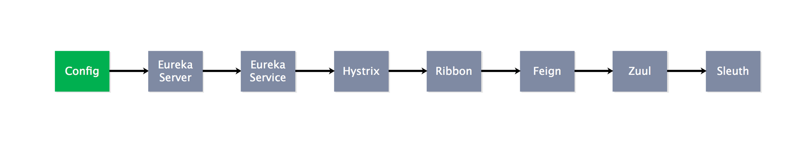
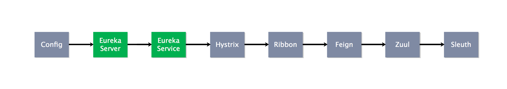
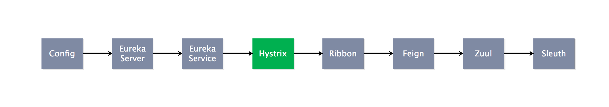
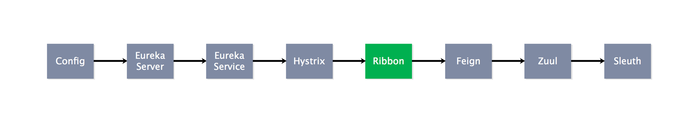
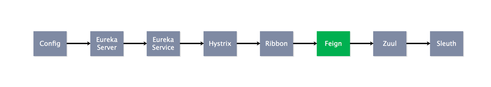
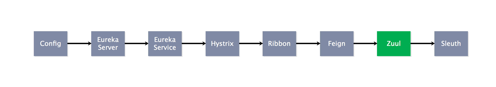
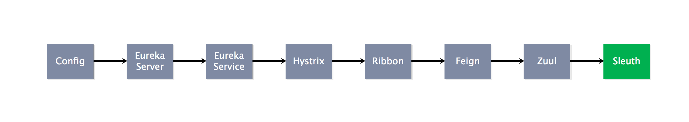

# [云框架]基于Spring Cloud的微服务架构 v0.1


[](CHANGELOG.md)

[](CONTRIBUTORS.md)

[微服务](https://martinfowler.com/articles/microservices.html)近年来受到了众多开发者的追捧。相比传统架构模式，微服务架构具有语言无关性、独立进程通讯、高度解耦、任务边界固定、按需扩展等特点，非常适合互联网公司快速交付、响应变化、不断试错的需求，也因此受到了像Twitter、Netflix、Amazon、eBay这样的科技巨头的青睐（[案例](https://mp.weixin.qq.com/s?__biz=MzIwMDA2OTI0Mw==&mid=2653449136&idx=2&sn=0e6bc2215646064c9a35398a8fb00299&chksm=8d5e12a4ba299bb2bf75f5b8aebb645c186932b6507dbd2ca9372dbd5b0f4d0a5a43e9fce72d#rd)）。

目前主流微服务框架包括Spring Cloud、Dubbo、API Gateway等，其中[Spring Cloud](http://projects.spring.io/spring-cloud/)是Pivotal提供的云应用开发工具，利用Spring Boot的开发便利性，Spring Cloud为JVM云应用开发中的配置管理、服务发现、断路器、智能路由、微代理、控制总线、全局锁、决策竞选、分布式会话和集群状态管理等操作提供了一种简单的实现方式。

相比Dubbo等RPC（远程过程调用协议）框架，Spring Cloud是一个比较新的微服务架构基础框架选择，2016年才推出的1.0 release版本，不过Spring Cloud的方案完整度非常高，各个子项目几乎覆盖了微服务架构的方方面面。从目前的关注度和活跃度来看，Spring Cloud很可能会成为微服务架构的标准。

本篇[**[云框架]**](ABOUT.md)目的不在于重复造轮（[Spring Cloud官方文档](https://spring.io/docs)），而是总结过去数十个微服务架构项目的成功经验，为开发者提供微服务落地的最佳实践。不必从零开始开发，开发者仅需在[云框架]基础上替换部分业务代码，就可以将[基于Spring Cloud的微服务架构](README.md)应用于生产环境并立即产生价值。

如果你是初学者，可顺序阅读操作，快速上手；如果你想要快速部署，可直接跳转至[一条命令部署](#一条命令部署)。

# 内容概览

* [组件说明](#组件说明) 
* [使用向导](#使用向导)
* [常见问题](#常见问题)
* [参与贡献](#参与贡献)
* [加入社群](#加入社群)

# <a name="组件说明"></a>组件说明

**DEMO地址：**[]()

**包括如下核心组件（点击[组件名称](#组件名称)跳转至组件源码）：**

| <a name="组件名称"></a>核心组件 | 功能 | 简介 |
| --- | --- | --- |
| [Spring Cloud Config - server](https://github.com/cloudframeworks-springcloud/Spring-Cloud-Config-client) | 配置管理开发工具包 | 允许用户把配置放到远程服务器，支持本地存储、Git及Subversion |
| [Spring Cloud Config - client](https://github.com/cloudframeworks-springcloud/Spring-Cloud-Config-server) |  |   |
| [Spring Cloud Config - 配置文件](https://github.com/cloudframeworks-springcloud/Spring-Cloud-Config) |  |  |
| [Netflix Eureka - server](https://github.com/cloudframeworks-springcloud/Netflix-Eureka-server) | 云端负载均衡 | 基于REST的服务，用于定位服务，以实现云端的负载均衡和中间层服务器的故障转移 |
| [Netflix Eureka - service](https://github.com/cloudframeworks-springcloud/Netflix-Eureka-service) |  |  |
| [Netflix Hystrix](https://github.com/cloudframeworks-springcloud/Netflix-Hystrix) | 容错管理工具 | 通过控制服务和第三方库的节点，从而对延迟和故障提供更强大的容错能力 |
| [Netflix Zuul](https://github.com/cloudframeworks-springcloud/Netflix-Zuul) | 边缘服务工具 | 提供动态路由，监控，弹性，安全等的边缘服务 |
| [Netflix Feign](https://github.com/cloudframeworks-springcloud/Spring-Cloud-Feign) | 客户端 | 声明式、模板化的HTTP客户端 |
| [Netflix Ribbon](https://github.com/cloudframeworks-springcloud/Netflix-Ribbon) | 云端负载均衡 | 有多种负载均衡策略可供选择，可配合服务发现和断路器使用 |
| [Spring Cloud Sleuth](https://github.com/cloudframeworks-springcloud/Spring-Cloud-Sleuth) | 日志收集工具包 | 封装了Dapper、Zipkin和HTrace操作 |

**架构图如下，其中实线箭头代表注册关系、虚线箭头代表调用关系：**

<div align=center></div>

# <a name="使用向导"></a>使用向导

### 1. Spring Cloud Config

<div align=center></div>

目前在项目中用到的配置切换方式经常是通过配置文件进行切换的，比如java语言开发的项目使用Maven定义profile进行，配置的修改需要重新打包，当部署节点大量增加，打包和部署就变成了一项大工程。现阶段流行的配置管理平台有disconf、diamond、qconf等。

Spring Cloud微服务套件也提供了配置管理组件Spring Cloud Config，基于使用中心配置仓库的思想（版本控制），支持Git、SVN。

**[如何搭建Spring Cloud config]**

第一步：选择Git或SVN作为你的配置仓库（这里选择git作为配置仓库）

第二步：创建相应的配置文件，如：[https://github.com/cloudframeworks-springcloud/Spring-Cloud-Config.git](https://github.com/cloudframeworks-springcloud/Spring-Cloud-Config.git)

第三步：创建Spring Cloud Config server，参考：[https://github.com/cloudframeworks-springcloud/Spring-Cloud-Config-server](https://github.com/cloudframeworks-springcloud/Spring-Cloud-Config-server)

第四步：创建Spring Cloud Config client，并从config server获取配置仓库中的信息，参考：[https://github.com/cloudframeworks-springcloud/Spring-Cloud-Config-client](https://github.com/cloudframeworks-springcloud/Spring-Cloud-Config-client)

第五步：运行`cloud-config server`和`cloud-config client`

### 2&3. Netflix Eureka

<div align=center></div>

相比传统SOA架构，微服务架构中的服务粒度更小、服务数量更多，如何有效管理各个服务就显得尤为重要，也因此出现了服务注册的概念。

服务注册的本质：

* 简单易用，对用户透明
* 高可用，满足CAP理论
* 多语言支持

在基于Spring Cloud的微服务架构中，通常采用Netflix Eureka作为注册中心，某些情况下也会采用Zookeeper作为替代。

Netflix Eureka的易用性体现在两方面：

1. 通过与Spring Boot(Cloud)结合达到只用注解和Maven依赖即可部署和启动服务的效果
2. Netflix Eureka自带Client包，使得使用Eureka作为注册中心的客户端（即服务）不需要关心自己与Eureka的通讯机制，只需要引入Client依赖即可，当然前提是使用Java

**Netflix Eureka通过“伙伴”机制实现高可用**，每一台Eureka都需要在配置中指定另一个Eureka的地址作为伙伴，Eureka启动时会向自己的伙伴节点获取当前已经存在的注册列表，这样在向Eureka集群中增加新机器时就不需要担心注册列表不完整的问题，在CAP理论中满足AP原则。

除此之外，**Netflix Eureka支持Region和Zone的概念**，其中一个Region可以包含多个Zone。Eureka在启动时需要指定一个Zone名，即指定当前Eureka属于哪个Zone, 如果不指定则属于defaultZone。值得注意的是，Eureka Client也需要指定Zone。

Netflix Eureka使用Java编写，但它会将所有注册信息和心跳连接地址都暴露为HTTP REST接口，客户端实际是通过HTTP请求与Server进行通讯的，因此Client完全可以使用其它语言进行编写，只需要即时调用注册服务、注销服务、获取服务列表和心跳请求的HTTP REST接口即可。

**[如何搭建Netflix Eureka server]**

第一步：下载Netflix Eureka server

Git地址：[https://github.com/cloudframeworks-springcloud/Netflix-Eureka-server.git](https://github.com/cloudframeworks-springcloud/Netflix-Eureka-server.git)

命令：`Git clone` [https://github.com/cloudframeworks-springcloud/Netflix-Eureka-server](https://github.com/cloudframeworks-springcloud/Netflix-Eureka-server)

第二步：构建Netflix Eureka server镜像

命令：`cd  Netflix-Eureka-server && docker build -t eureka-server .`

第三步：运行Netflix Eureka server

命令：`docker run -d -p 5000:5000 eureka-server`

第四步：访问[http://127.0.0.1:5000](http://127.0.0.1:5000)

完整代码：

```
        git clone https://github.com/cloudframeworks-springcloud/Netflix-Eureka-server
        
        cd  Netflix-Eureka-server && docker build -t eureka-server .
        
        docker run -d -p 5000:5000 eureka-server
```


**[注册一个服务到Eureka server]**

第一步：创建普通的应用服务

第二步：将该服务注册到Netflix Eureka中（通过`@EnableDiscoveryClient`）

第三步：设置Eureka server的地址

修改配置文件(根据自己的环境设置`EUREKA_HOST`和`EUREKA_PORT`)
`eureka.client.serviceUrl.defaultZone=http://127.0.0.1:5000/eureka/v2/`

第四步：运行Netflix Eureka service

第五步：去Netflix Eureka中查看是否已注册成功(备注：用户可以定义自己的业务逻辑)

参见：[https://github.com/cloudframeworks-springcloud/Netflix-Eureka-service.git](https://github.com/cloudframeworks-springcloud/Netflix-Eureka-service.git)

完整代码：

```
        git https://github.com/cloudframeworks-springcloud/Netflix-Eureka-service
        
        cd  Netflix-Eureka-service && docker build -t eureka-service .
        
        docker run -d -p 5000:5000 eureka-service
```

### 4. Netflix Hystrix

<div align=center></div>

组件说明：

第一步：

第二步：

第三步：

完整代码：

```
        git https://github.com/cloudframeworks-springcloud/Netflix-Hystrix.git
        
        cd  Netflix-Hystrix && docker build -t hystrix .
        
        docker run -d -p 5000:5000 hystrix
```

### 5. Netflix Ribbon

<div align=center></div>

代码参考：

第一步：

第二步：

第三步：

完整代码：

```
        git https://github.com/cloudframeworks-springcloud/Netflix-Ribbon.git
        
        cd  Netflix-Ribbon && docker build -t ribbon .
        
        docker run -d -p 5000:5000 ribbon
```

### 6. Netflix Feign

<div align=center></div>

Spring Cloud集成Netflix Ribbon和Netflix Eureka提供的负载均衡的HTTP客户端Netflix Feign.

Netflix Feign是一个声明式、模板化的HTTP客户端，因此编写起来会更容易一些。Spring Cloud集成了Netflix Feign，并通过Netflix Ribbon和Netflix Eureka提供负载均衡。

使用Netflix Feign创建一个接口并对它进行注解（可插拔的注解支持，包括Feign注解），在应用主类中通过`@EnableFeignClients`注解开启Feign功能，并使用`@FeignClient`(服务ID)注解来绑定该接口对应服务。

**[如何创建一个Netflix Feign]**

代码参考：[https://github.com/cloudframeworks-springcloud/Spring-Cloud-Feign.git](https://github.com/cloudframeworks-springcloud/Spring-Cloud-Feign.git)

第一步：创建普通的应用

第二步：将该应用主类中加入`@EnableFeignClients`

第三步：在service中用@FeignClient(服务ID)注解来绑定该接口对应服务

第四步：修改配置文件(根据自己的环境设置EUREKA_HOST和EUREKA_PORT)

`eureka.client.serviceUrl.defaultZone=http://127.0.0.1:5000/eureka/v2/`

第五步：构建镜像，运行service

完整代码：

```
        git https://github.com/cloudframeworks-springcloud/Spring-Cloud-Feign.git
        
        cd  Spring-Cloud-Feign && docker build -t feign .
        
        docker run -d -p 5000:5000 feign
```

### 7. Netflix Zuul

<div align=center></div>

**[如何创建一个Netflix Zuul]**

代码参考：[https://github.com/cloudframeworks-springcloud/Netflix-Zuul.git](https://github.com/cloudframeworks-springcloud/Netflix-Zuul.git)

第一步：

第二步：

第三步：

完整代码：

```
        git https://github.com/cloudframeworks-springcloud/Netflix-Zuul.git
        
        cd  Netflix-Zuul && docker build -t zuul .
        
        docker run -d -p 5000:5000 zuul
```

### 8. Spring Cloud Sleuth

<div align=center></div>

**[如何创建一个Sleuth]**

第一步：

第二步：

第三步：

完整代码：

```
        git https://github.com/cloudframeworks-springcloud/Spring-Cloud-Sleuth.git
        
        cd  Spring-Cloud-Sleuth && docker build -t sleuth .
        
        docker run -d -p 5000:5000 sleuth
```

## <a name="一条命令部署"></a>一条命令部署

## <a name="高级操作"></a>高级操作

## <a name="可用性测试"></a>可用性测试

# <a name="常见问题"></a>常见问题

相关问题可通过[GitHub ISSUE](https://github.com/cloudframeworks-springcloud/user-guide/issues)提交或讨论，点击查看[常见问题汇总](QA.md)

# <a name="参与贡献"></a>参与贡献

[如何成为云框架贡献者](CONTRIBUTING.md)

# <a name="加入社群"></a>加入社群

+ [订阅邮件](http://goodrain.us15.list-manage.com/subscribe?u=1874f1de4ed82a52890cefb4c&id=b88f73ca56)
+ QQ群1: 531980120
+ 微信二维码（发布时补充）
+ [联系我们](mailto:info@goodrain.com)

-------

[云框架](ABOUT.md)系列主题，遵循[APACHE LICENSE 2.0](LICENSE.md)协议发布。
