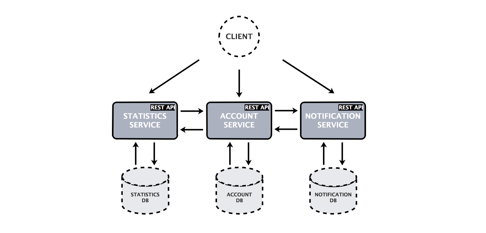
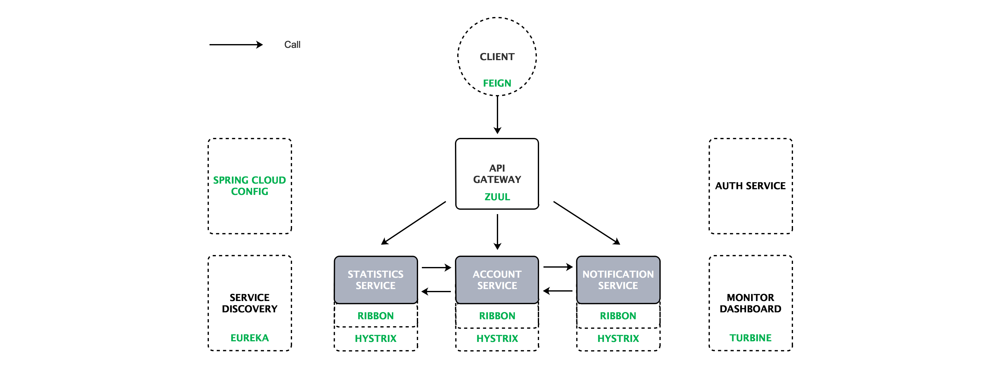
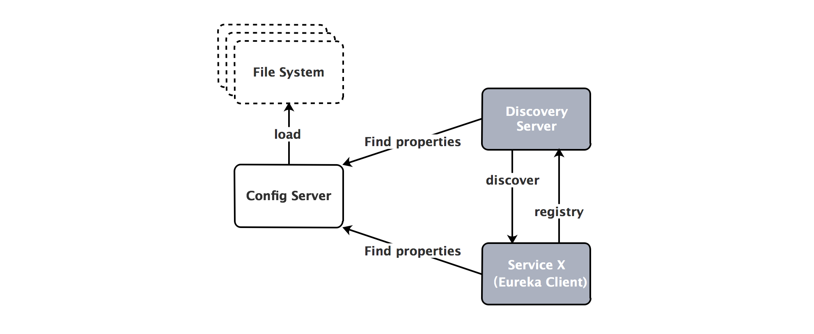
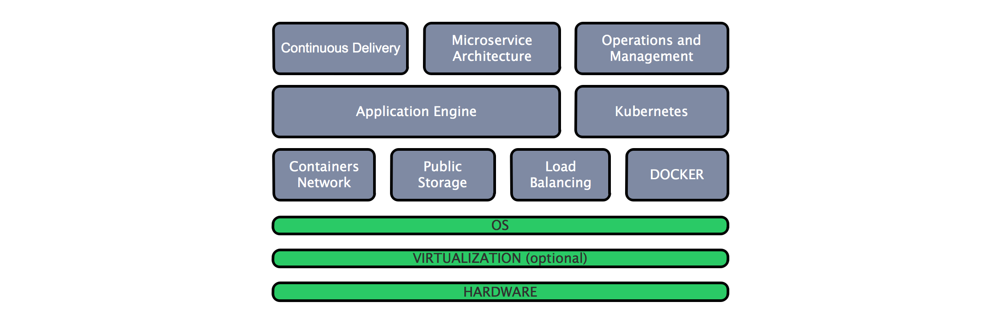
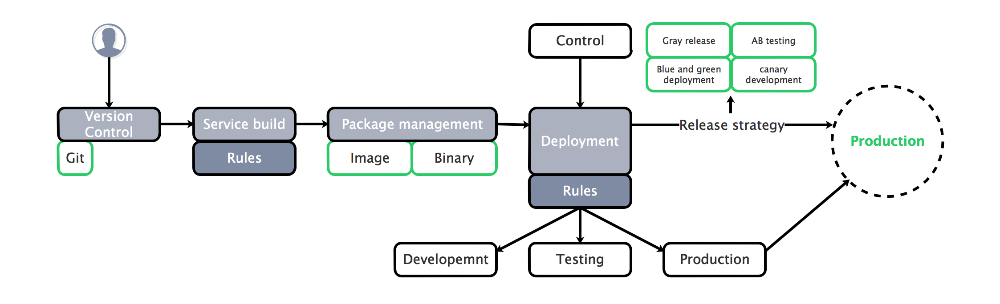
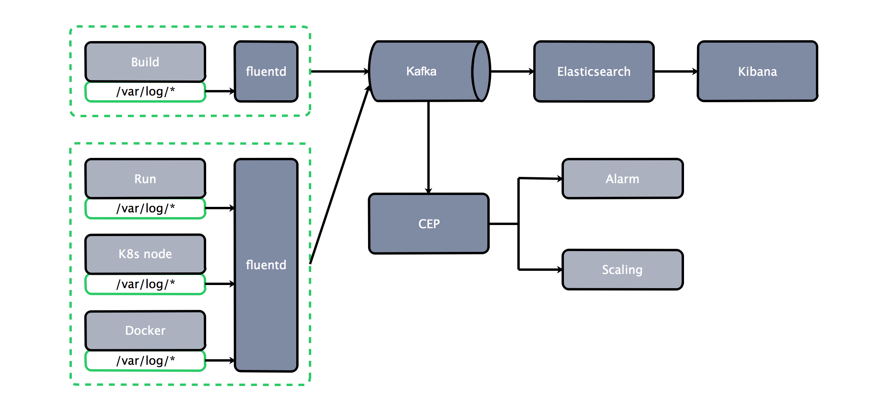
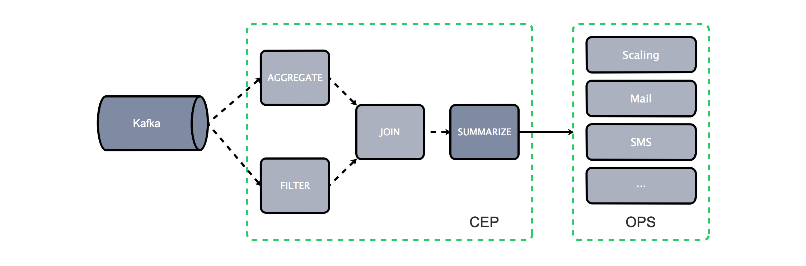

# [云框架]基于Spring Cloud的微服务架构 v1.5


[](CONTRIBUTORS.md)


**README in English available, see [README_EN](README.md)**

[微服务](https://martinfowler.com/articles/microservices.html)与传统架构模式相比，具有语言无关性、独立进程通讯、高度解耦、任务边界固定、按需扩展等特点，非常适合互联网公司快速交付、响应变化、不断试错的需求，也因此受到了像Twitter、Netflix、Amazon、eBay这样的科技巨头的青睐。

目前主流微服务框架包括Spring Cloud、Dubbo、API Gateway等，其中[Spring Cloud](http://projects.spring.io/spring-cloud/)是一套快速构建分布式系统中常见工具的集合，利用Spring Boot的开发便利性，Spring Cloud为JVM云应用开发中的配置管理、服务发现、断路器、智能路由、微代理、控制总线、全局锁、决策竞选、分布式会话和集群状态管理等操作提供了一种简单的实现方式。

相比Dubbo等RPC框架，Spring Cloud是一个比较新的微服务基础框架选择，2016年才推出的1.0 release版本，不过Spring Cloud的方案完整度非常高，各个子项目几乎覆盖了微服务架构的方方面面。从目前的关注度和活跃度来看，Spring Cloud很可能会成为微服务架构的标准。([Spring Cloud技术分析](http://tech.lede.com/2017/03/15/rd/server/SpringCloud0/))

本篇[云框架](ABOUT.md)总结过去数十个微服务架构项目的成功经验，并结合典型案例[PiggyMetrics](https://github.com/cloudframeworks-springcloud/PiggyMetrics)（一款个人财务管理应用），为开发者提供基于Spring Cloud的微服务架构落地最佳实践。

* 初学者可通过实例代码、文档快速学习Spring Cloud及微服务，并在社群中交流讨论
* 已有一定了解的开发者，不必从零开始开发，仅需在云框架基础上替换部分业务代码，即可将最佳实践应用于生产环境并立即产生价值

相关云框架：[[云框架]KONG API Gateway](https://github.com/cloudframeworks-apigateway/user-guide-apigateway)

# 内容概览

* [快速部署](#快速部署)
    * [一键部署](#一键部署)
    * [本地部署](#本地部署)
* [框架说明-业务](#框架说明-业务)
* [框架说明-组件](#框架说明-组件)
   * [组件架构](#组件架构)
   * [配置Spring Cloud Config](#Spring-Cloud-Config)
   * [配置Netflix Eureka](#Netflix-Eureka)
   * [配置Netflix Zuul](#Netflix-Zuul)
   * [配置Netflix Ribbon](#Netflix-Ribbon)
   * [配置Netflix Hystrix](#Netflix-Hystrix)
   * [配置Netflix Feign](#Netflix-Feign)
* [如何变成自己的项目](#如何变成自己的项目)
* [生产环境](#生产环境)
* [更新计划](#更新计划)
* [社群贡献](#社群贡献)

# <a name="快速部署"></a>快速部署

## <a name="一键部署"></a>一键部署

[一键部署至Rainbond](https://www.goodrain.com/#/app/detail/15)

## <a name="本地部署"></a>本地部署

1. [准备Docker环境](./READMORE_CN/install-docker.md)

2. 克隆完整代码

   ```
   git clone https://github.com/cloudframeworks-springcloud/PiggyMetrics
   ```

3. 设置环境变量

   ```
   export CONFIG_SERVICE_PASSWORD=root
   export NOTIFICATION_SERVICE_PASSWORD=root
   export STATISTICS_SERVICE_PASSWORD=root
   export ACCOUNT_SERVICE_PASSWORD=root
   export MONGODB_PASSWORD=root         ## 必填，其他变量可不设置
   ```

4. 使用[docker-compose](https://docs.docker.com/compose/install/)运行如下命令（[docker-compose.yml](https://github.com/cloudframeworks-springcloud/PiggyMetrics/blob/master/docker-compose.yml)）（或查看[通过脚本分别部署每个组件](./READMORE_CN/deploy-via-script.md)）

   ```
   docker-compose -f docker-compose.yml up -d
   ```

5. 访问路径

   http://DOCKER-HOST:80 - Gateway
   
   http://DOCKER-HOST:8761 - Eureka Dashboard
   
   http://DOCKER-HOST:9000/hystrix - Hystrix Dashboard
   
   http://DOCKER-HOST:8989 - Turbine stream (source for the Hystrix Dashboard)
   
   http://DOCKER-HOST:15672 - RabbitMq management (默认账号guest／默认密码guest)

# <a name="框架说明-业务"></a>框架说明-业务

Piggymetrics通过Spring Cloud实现微服务架构，应用被分解为**账户服务**（[ACCOUNT SERVICE](https://github.com/cloudframeworks-springcloud/PiggyMetrics/tree/master/account-service)）、**统计服务**（[STATISTICS SERVICE](https://github.com/cloudframeworks-springcloud/PiggyMetrics/tree/master/statistics-service)）、**通知服务**（[NOTIFICATION SERVICE](https://github.com/cloudframeworks-springcloud/PiggyMetrics/tree/master/notification-service)）等三个核心微服务。每个微服务都是围绕业务能力组织的可独立部署的应用程序，拥有独立的数据库并使用同步的[REST API](http://www.restapitutorial.com/)实现微服务与微服务之间的通信。

PiggyMetrics业务架构如下图所示：

<div align=center></div>

账户服务模块包含一般用户输入逻辑和验证：收入/费用项目，储蓄和帐户设置。

方法	| 路径	| 描述	| 用户验证	| UI可用
------------- | ------------------------- | ------------- |:-------------:|:----------------:|
GET	| /accounts/{account}	| 获取特定账户数据	|  | 	
GET	| /accounts/current	| 获取当前账户数据	| × | ×
GET	| /accounts/demo	| 获取demo账户数据 (预填充收入/支出项目等)	|   | 	×
PUT	| /accounts/current	| 保存当前账户数据	| × | ×
POST	| /accounts/	| 注册新账户	|   | ×

统计服务模块执行主要统计参数的计算，并捕获每个帐户的时间序列。

方法	| 路径	| 描述 | 用户验证	| UI可用
------------- | ------------------------- | ------------- |:-------------:|:----------------:|
GET	| /statistics/{account}	| 获取特定账户统计	          |  | 	
GET	| /statistics/current	| 获取当前账户统计	| × | × 
GET	| /statistics/demo	| 获取demo账户统计	|   | × 
PUT	| /statistics/{account}	| 创建或更新时间系列数据点指定的帐户	|   | 

通知服务模块存储用户联系信息和通知设置（如提醒和备份频率），计划工作人员从其他服务收集所需的信息，并向订阅的客户发送电子邮件。

方法	| 路径	| 描述	| 用户验证	| UI可用
------------- | ------------------------- | ------------- |:-------------:|:----------------:|
GET	| /notifications/settings/current	| 获取当前账户通知设置	| × | ×	
PUT	| /notifications/settings/current	| 保存当前账户通知设置	| × | ×

# <a name="框架说明-组件"></a>框架说明-组件

<a name="组件架构"></a>Piggymetrics基础服务设施中用到了Spring Cloud Config、Netflix Eureka、Netflix Hystrix、Netflix Zuul、Netflix Ribbon、Netflix Feign等组件，而这也正是Spring Cloud分布式开发中最核心的组件。

组件架构如下图所示：

<div align=center></div>

* 账户服务通过远程客户端（Feign）调用统计服务及通知服务，通过Ribbon实现负载均衡，并在调用过程中增加了断路器（Hystrix）的功能；

* 由于服务发现后才能调用，因此账户服务、统计服务、通知服务通过注册中心（Eureka）实现互相发现；

* API Gateway（Zuul）提供对外统一的服务网关，首先从注册中心（Eureka）处获取相应服务，再根据服务调用各个服务的真实业务逻辑；

* 服务调用过程通过聚合器（Turbine）统一所有断路信息；

* 整个业务过程中所有服务的配置文件通过Spring Cloud Config来管理，即起什么端口、配置什么参数等；

* 认证机制通过Auth service实现，提供基本认证服务；

* Spring Cloud Config、Eureka、Ribbon、Hystrix、Feign以及Turbine均为标准组件，与业务之间没有强关系，不涉及到业务代码，仅需简单配置即可工作。

## <a name="Spring-Cloud-Config"></a>配置Spring Cloud Config

在PiggyMetrics项目中，[config_server](https://github.com/cloudframeworks-springcloud/PiggyMetrics/tree/master/config)从本地类路径加载配置文件：

<div align=center></div>

我们可以在[config service](https://github.com/cloudframeworks-springcloud/PiggyMetrics/tree/master/config/src/main/resources/shared)中查看shard目录资源，其中`application.yml`被所有客户端应用共享，比如当Notification-service请求配置时，使用`shared/notification-service.yml`和`shared/application.yml`配置服务响应。

使用Spring Cloud config需要在[pom.xml](https://github.com/cloudframeworks-springcloud/PiggyMetrics/blob/master/config/pom.xml)中添加spring-cloud-starter-config（它将从配置中心自动获取配置），并在各服务资源目录bootstrap.yml中，例如[moinitoring的bootstrap.yml](https://github.com/cloudframeworks-springcloud/PiggyMetrics/blob/master/monitoring/src/main/resources/bootstrap.yml)中添加如下代码：

   ```
   spring:
     application:
       name: 服务名
     cloud:
       config:
         uri: http://config:8888
         fail-fast: true
   ```

配置文件修改后可通过 http://DOCKER-HOST:DOCKER-PORT/xxx/refresh 刷新配置(xxx表示服务根路径)，无需重启服务。

**[进一步了解Spring Cloud Config](./READMORE_CN/spring-cloud-config.md)**

## <a name="Netflix-Eureka"></a>配置Netflix Eureka

PiggyMetrics通过Eureka server实现[registy](https://github.com/cloudframeworks-springcloud/PiggyMetrics/tree/master/registry), 代码逻辑比较简单和标准，不用做任何修改，需要注意的是在[bootstrap.yml](https://github.com/cloudframeworks-springcloud/PiggyMetrics/blob/master/registry/src/main/resources/bootstrap.yml)加入配置中心服务地址信息。

   ```
   spring:
    cloud:
      config:
        uri: http://config:8888
        fail-fast: true
        password: ${CONFIG_SERVICE_PASSWORD}
        username: user
   ```

**[进一步了解Netflix Eureka](./READMORE_CN/netflix-eureka.md)**

## <a name="Netflix-Zuul"></a>配置Netflix Zuul

PiggyMetrics借助Netflix Zuul实现[gateway](https://github.com/cloudframeworks-springcloud/PiggyMetrics/tree/master/gateway)，代理授权服务、账户服务、统计服务和通知服务，这里的代码比较简单，基本上是标准的，不需要修改。

我们在实际业务的开发中，在[GatewayApplication.java](https://github.com/cloudframeworks-springcloud/PiggyMetrics/blob/master/gateway/src/main/java/com/piggymetrics/gateway/GatewayApplication.java)用具体业务替换相应的服务即可。

   ```
   @EnableZuulProxy        ## 增加zuul proxy代理功能
   public class GatewayApplication {
       public static void main(String[] args) {
           SpringApplication.run(GatewayApplication.class, args);
       }
   }
   ```

在resources目录下增加[static](https://github.com/cloudframeworks-springcloud/PiggyMetrics/tree/master/gateway/src/main/resources/static)存放你的静态资源(如html、css、images等)
     
在zuul的配置文件[gateway.yml](https://github.com/cloudframeworks-springcloud/PiggyMetrics/blob/master/config/src/main/resources/shared/gateway.yml)中增加代理服务的配置

   ```
   zuul:
   ignoredServices: '*'
   host:
     connect-timeout-millis: 20000        ## 超时时间
      ocket-timeout-millis: 20000
   routes:
     auth-service:                        ## 认证服务
         path: /uaa/**                    ## 匹配路径
         url: http://auth-service:5000    ## 服务路径（http方式）
         stripPrefix: false               ## 是否包括前缀
         sensitiveHeaders:
     account-service:
         path: /accounts/**
         serviceId: account-service       ## 通过服务ID动态查找
         stripPrefix: false
         sensitiveHeaders:
     statistics-service:
         path: /statistics/**
         serviceId: statistics-service
         stripPrefix: false
         sensitiveHeaders:
     notification-service:
         path: /notifications/**
         serviceId: notification-service
         stripPrefix: false
         sensitiveHeaders:
   ```

**[进一步了解Netflix Zuul](./READMORE_CN/netflix-zuul.md)**

## <a name="Netflix-Ribbon"></a>配置Netflix Ribbon

PiggyMetrics并没有显式的去定义Netflix Ribbon的使用，但是在Zuul、Feign等组件中隐式的使用到了Ribbon，我们在实际的业务开发中，也不需要刻意定义Ribbon。

**[进一步了解Netflix Ribbon](./READMORE_CN/netflix-ribbon.md)**

## <a name="Netflix-Hystrix"></a>配置Netflix Hystrix

项目中统一定义了熔断策略（不涉及代码侵入）：
       
   ```
   hystrix:
     command:
       default:
         execution:
           isolation:
             thread:
               timeoutInMilliseconds: 10000   ## 10000ms 超时限制
   ```

由于Hystrix的监控只针对单个节点，因此PiggyMetrics通过**Netflix Turbine**来监控集群下Hystrix的metrics情况。

实现客户端将Hystrix命令推送到Turbine，只需要在客户端添加如下代码即可，例如[/notification-service/pom.xml](https://github.com/cloudframeworks-springcloud/PiggyMetrics/blob/master/notification-service/pom.xml#L79)。

   ```
   <dependency>
       <groupId>org.springframework.cloud</groupId>
       <artifactId>spring-cloud-netflix-hystrix-stream</artifactId>
   </dependency>
   ```

**[进一步了解Netflix Hystrix](./READMORE_CN/netflix-hystrix.md)**

## <a name="Netflix-Feign"></a>配置Netflix Feign

PiggyMetrics多次用到了Feign，使用方法为在客户端中添加如下代码，例如[StatisticsServiceClient.java](https://github.com/cloudframeworks-springcloud/PiggyMetrics/blob/master/account-service/src/main/java/com/piggymetrics/account/client/StatisticsServiceClient.java)。

   ```
   @FeignClient(name = "auth-service")      ## 声明一个认证服务的一个客户端，通过注册中心去查找auth-service
    public interface AuthServiceClient {
        
        @RequestMapping(method = RequestMethod.POST, value = "/uaa/users", consumes = MediaType.APPLICATION_JSON_UTF8_VALUE)
        void createUser(User user);
        
    }
    
   ```
 
Feign同时可以引用注册中心以外的服务，例如在统计服务模块，Feign引入了一个汇率客户端[ExchangeRatesClient.java](https://github.com/cloudframeworks-springcloud/PiggyMetrics/blob/master/statistics-service/src/main/java/com/piggymetrics/statistics/client/ExchangeRatesClient.java)。

   ```
   @FeignClient(url = "${rates.url}", name = "rates-client") ## 声明一个汇率客户端，根据具体的url（这个可以是外部的服务）
   public interface ExchangeRatesClient {
        
       @RequestMapping(method = RequestMethod.GET, value = "/latest")
       ExchangeRatesContainer getRates(@RequestParam("base") Currency base);
        
   }
   ```

**[进一步了解Netflix Feign](./READMORE_CN/netflix-feign.md)**

# <a name="如何变成自己的项目"></a>如何变成自己的项目 

1. git clone项目到本地，并基于该项目创建自己的mvn项目

2. 将auth-service、account-service、notification-service、statistics-service替换成自己的服务

   * *config、registry、gateway、monitoring代码无需修改*

3. 在config中修改统一的配置文件，比如新增服务的服务名、端口等
     
4. 通过mvn构建后生成镜像
     
5. 运行所有的镜像，参考[快速部署](#快速部署)
     
# <a name="生产环境"></a>生产环境

生产环境中的应用服务需要满足以下基本特征：

   1. 部分软件、硬件或网络异常后，应用依然能够可靠工作
   
   2. 多用户支持下应用继续工作
   
   3. 可添加或删除资源来适应不同需求变化
   
   4. 便于部署和监控

换句话说，在生产环境下，我们需要考虑更多、更复杂的因素以满足实际业务及支持业务的特性。

对于微服务架构，推荐使用`Docker`+`Kubernetes`PaaS平台搭建，合理结构如下：

<div align=center></div>

[为什么使用Docker？](https://yeasy.gitbooks.io/docker_practice/content/introduction/why.html)
   
[为什么使用Kubernetes？](https://blog.gcp.expert/kubernetes-gke-introduction/)

[Container, Docker, and Kubernetes](https://collectiveidea.com/blog/archives/2017/01/27/containers-docker-and-kubernetes-part-1)

## 安装Kubernetes

Kubernetes提供了多种详尽的安装方式，此处不再赘述，建议参考：
   
   * [Kubernetes官方文档：Picking the Right Solution](https://kubernetes.io/docs/setup/pick-right-solution/)
   
   * [Kubernetes學習筆記](https://gcpug-tw.gitbooks.io/kuberbetes-in-action/content/)

## 部署应用至Kubernetes

服务编排（Service Orchestration）是**设计、创建和提供端到端服务的过程**，常常出现在面向服务架构、虚拟化、配置、融合基础架构、动态数据中心等等相关内容中，目前最流行的服务编排工具非Kubernetes（K8s）莫属。

Kubernetes将组成应用的容器组合为逻辑单元，以便于管理和发现。它的功能十分完善，提供包括资源调度、服务发现、运行监控、扩容缩容、负载均衡、灰度升级、失败冗余、容灾恢复、DevOps等一系列选项，帮助实现大规模、分布式、高可用的Docker集群，为解决业务的分布式架构、服务化设计，完整定义了构建业务系统的标准化架构层，即Cluster、Node、Pod、Label等一系列的抽象都是定义好的，为服务编排提供了一个简单、轻量级的方式。[Kubernetes: a platform for automating deployment, scaling, and operations](https://www.slideshare.net/BrianGrant11/wso2con-us-2015-kubernetes-a-platform-for-automating-deployment-scaling-and-operations)

在部署应用至Kubernetes之前，我们需要对应用的生命周期有一定了解。

<div align=center></div>

   * 使用Git进行代码版本管理（重点在于Git是分布式，[Git vs SVN](http://stackoverflow.com/questions/871/why-is-git-better-than-subversion)）
   
   * 明确服务的构建规则
   
   * 采用Image或Binary应用包管理
   
   * 制定包括开发、测试、生产及审核在内的服务部署规则
   
   * 根据实际业务需求选择适合的发布机制（[灰度发布、AB测试、蓝绿部署、金丝雀部署](http://blog.christianposta.com/deploy/blue-green-deployments-a-b-testing-and-canary-releases/)）

**部署PiggyMetrics至Kubernetes**

[查看PiggyMetrics应用结构图](./image/piggymetrics-k8s.png)

[查看PiggyMetrics完整Yaml文件](https://github.com/cloudframeworks-springcloud/user-guide-springcloud/tree/master/yaml)

**步骤：**

1. 安装Kubernetes、Docker环境

2. 创建命名空间

    ```
    kubectl -s 127.0.0.1:8080 create namespace springcloud
    ```

3. 配置容器DNS ([查看dns/dns-addon.yaml文件](https://github.com/cloudframeworks-springcloud/user-guide-springcloud/tree/master/yaml/dns))

    ```
    kubectl -s 127.0.0.1:8080 create －f dns/dns-addon.yaml文件 --namespace=springcloud
    ```

4. 创建服务 ([查看svc/yaml文件](https://github.com/cloudframeworks-springcloud/user-guide-springcloud/tree/master/yaml/svc))

    ```
    kubectl -s 127.0.0.1:8080 create -f svc/yaml文件 --namespace=springcloud
    ```

5. 创建应用部署 ([查看deployment/yaml文件](https://github.com/cloudframeworks-springcloud/user-guide-springcloud/tree/master/yaml/deployment))

    ```
    kubectl -s 127.0.0.1:8080 create -f deployment/yaml文件 --namespace=springcloud
    ```

    备注：
    
    127.0.0.1:8080－－－－kubernetes api server
    
    svc/yaml文件－－－－svc部署yaml文件
    
    deployment/yaml文件－－－－deployment部署yaml文件

## 功能特性实现

### 配置中心高可用

在生产环境中服务从配置中心读取文件，而配置中心从Gitlab读取配置文件，将配置中心做成一个集群化微服务即可实现高可用，满足大量服务的需求。

结构图如下：

<div align=center></div>

### 服务注册发现机制

在生产环境中服务注册发现管理采用Eureka Server进行，并**采用3个对等节点进行两两注册以实现高可用**。

结构图如下：

<div align=center></div>

### 服务容错机制

通过Hystrix进行熔断处理，同时通过Hystrix Dashboard实现图形化展示，并**加入RabbitMQ使其由默认的主动“拉”的方式，变为通过MQ消息队列进行“推”的模式**，以保证简单结构和实时效率。

结构如下图所示：

<div align=center></div>

### 日志采集

在生产环境中通过**EFKA**（elasticsearch fluentd kibana kafka）进行日志收集和展示。

结构如下图所示：

<div align=center></div>

### 监控体系

通过实时的日志收集系统获取日志信息，并利用时间窗口的技术进行日志分析。

结构如下图所示：

<div align=center></div>

## Spring Cloud性能优化

在生产环境中，我们可按照以下几点进行性能优化:

1、注册中心配置优化

    eureka:
      instance:
        prefer-ip-address: true
      client:
        registerWithEureka: false
        fetchRegistry: false
        server:
          waitTimeInMsWhenSyncEmpty: 0
      server:
        eviction-interval-timer-in-ms: 4000
        enableSelfPreservation: false
        renewalPercentThreshold: 0.9
        
2、zuul配置优化

    ribbon:
      ReadTimeout: 20000
      ConnectTimeout: 20000
      MaxAutoRetries: 1
      
    zuul:
      host:
        connect-timeout-millis: 20000
        socket-timeout-millis: 20000
        
3、Feign配置

    #请求和响应GZIP压缩支持
    feign.compression.request.enabled=true
    feign.compression.response.enabled=true
    #支持压缩的mime types
    feign.compression.request.enabled=true
    feign.compression.request.mime-types=text/xml,application/xml,application/json
    feign.compression.request.min-request-size=2048

# <a name="更新计划"></a>更新计划

* `文档` 增加&完善文档外链
* `组件` 单个组件深入讲解
* `常见问题` 问题汇总

点击查看[历史更新](CHANGELOG.md)

# <a name="社群贡献"></a>社群贡献

+ QQ群: 531980120
+ [参与贡献](CONTRIBUTING.md)
+ [联系我们](mailto:info@goodrain.com)

-------

[云框架](ABOUT.md)系列主题，遵循[APACHE LICENSE 2.0](LICENSE.md)协议发布。


