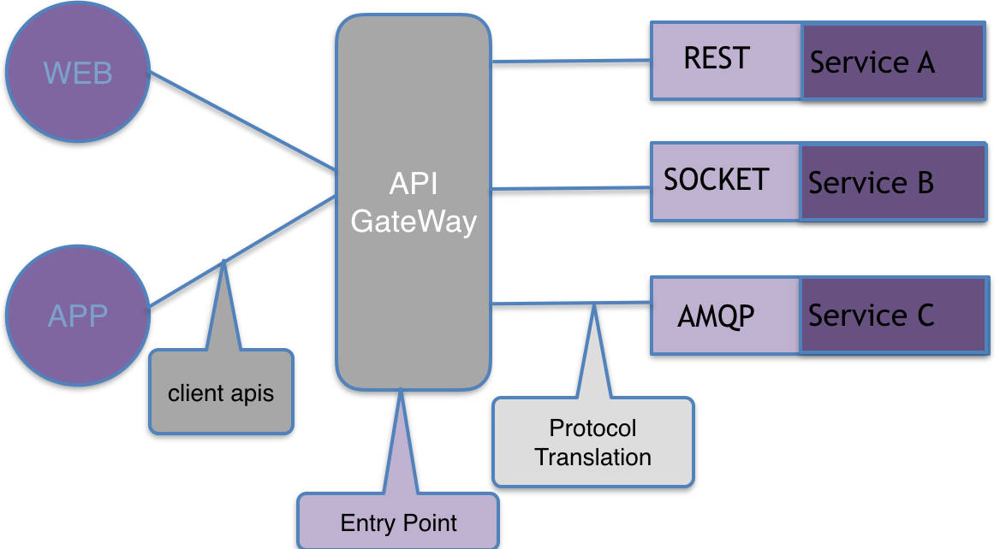
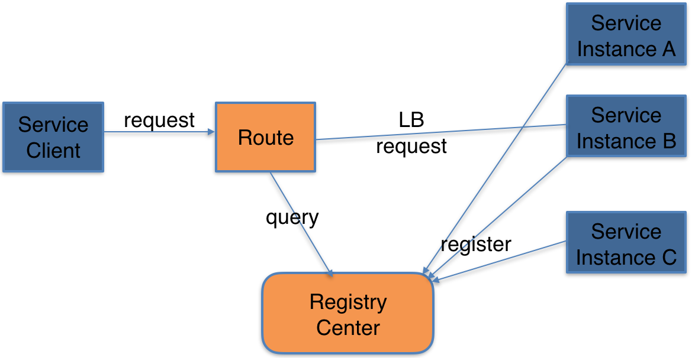

微服务介绍
===============
  
## 什么是微服务？
&emsp;&emsp;微服务架构（Microservices Architecture）是将应用拆分成小业务单元开发和部署，使用轻量级协议通信，通过协同工作实现应用逻辑的架构模式。
  
## 微服务特点
* 服务组件化－－应用拆分成不同服务运行在不同进程中，明确定义服务边界

* 按业务划分服务与组织－－业务领域的全栈（从前端到后端）软件实现

* 去中心化－－针对业务特征选择不同的技术水平，针对性的解决问题

* 设计失败－－服务的消费方需要优雅的处理错误

* 智能终端－－业务逻辑在服务内部处理；服务间通信尽轻量化，不添加任何额外的业务规则

* 自动化－－开发、调试、测试、集成、监控和发布

* API GateWay－－统一暴露服务接口；对服务认证、授权、监控、路由等

## 微服务如何落地
* 如何访问这些服务

* 服务如何发现

* 服务如何通信

* 数据如何管理

* 服务如何容错

* 服务如何监控

## springcloud 是什么？
&emsp;&emsp;Spring Cloud是一系列框架的有序集合。它利用Spring Boot的开发便利性巧妙地简化了分布式系统基础设施的开发，如服务发现注册、配置中心、消息总线、负载均衡、断路器、数据监控等，都可以用Spring Boot的开发风格做到一键启动和部署

## springcloud 核心组件

## 示例学习路径

## 版权信息
  
云框架遵循APACHE LICENSE 2.0协议发布，并提供免费使用。
  
细节参阅 [LICENSE.md](链接)
